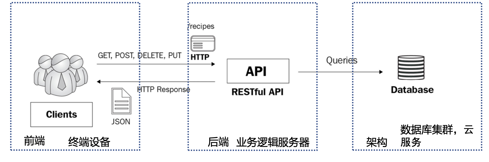

# Full Stack With Angular

## 1. 逻辑结构

### 1.1 前端

    - React

- json

  - {}
  - []

### 1.2 后端

- 业务逻辑
  - role

    - user story
  - infra

    - 表与关系
      - 一对一
      - 多对一
- 交互 Go lang
  - GORM (后端-infra交互)
  - Gin（前端-后端交互）

### 1.3 架构

- 数据
  - 持久化
  - 选择展示
  - 组织 检索
- CRUD
  - post， get， put， delete
